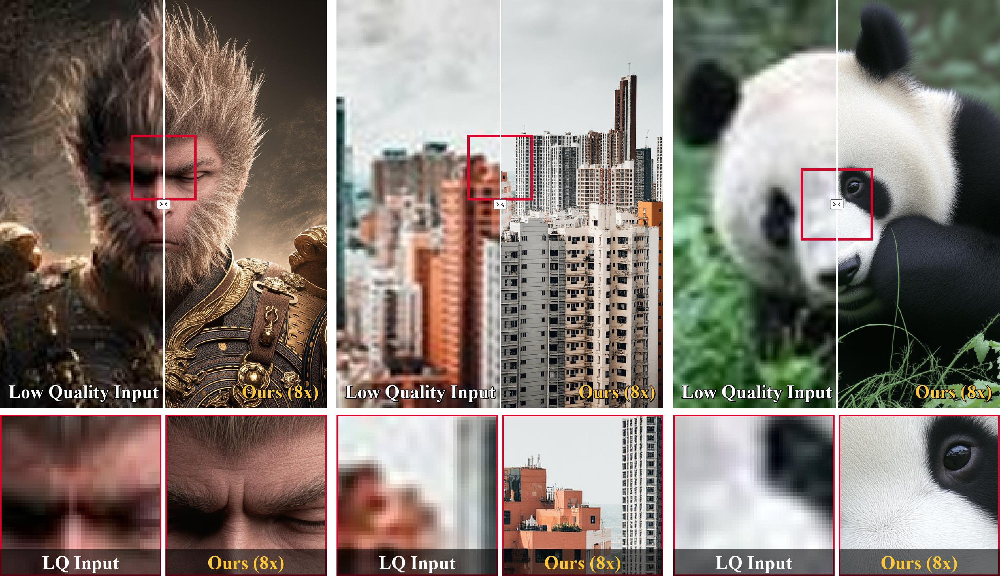
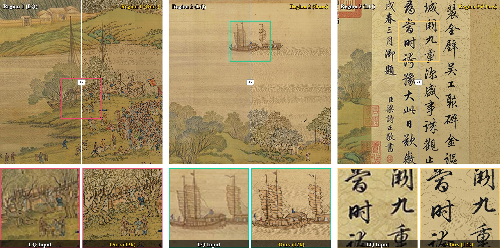
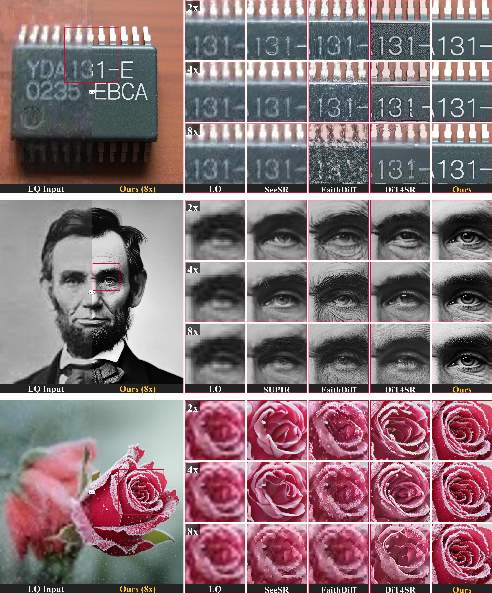
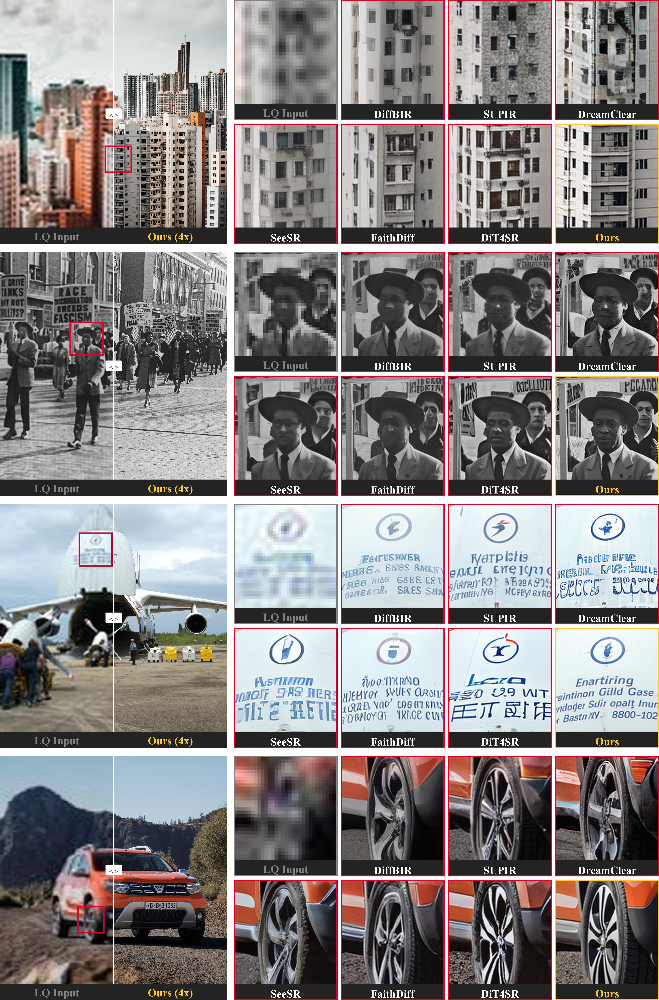
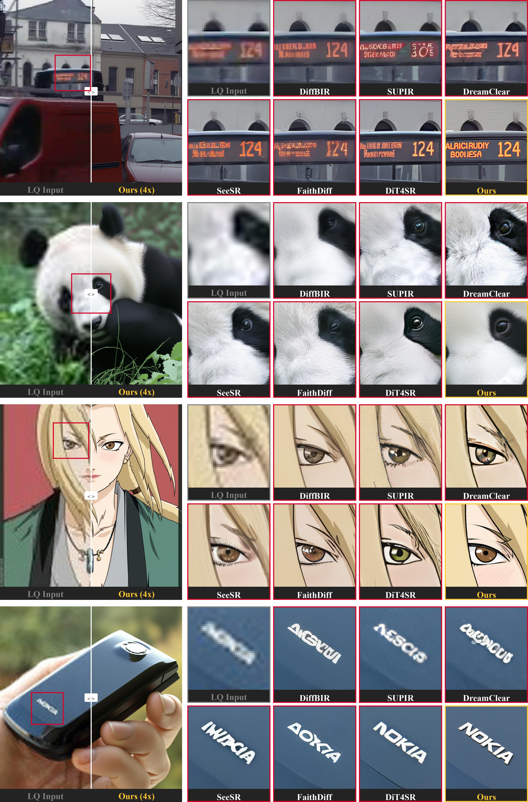
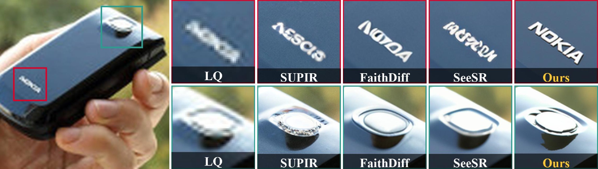
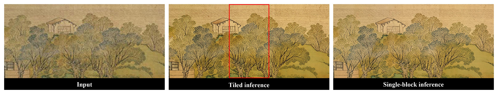
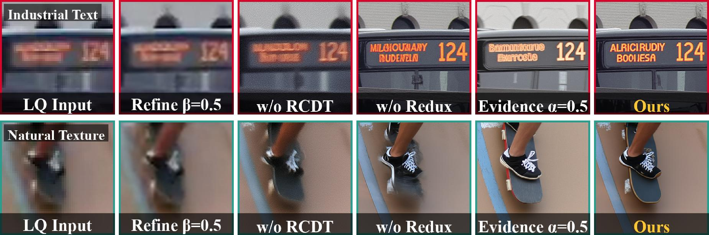

# Fill2SR: Repurposing Inpainting Diffusion Transformers for Real-World Super-Resolution

**ECCV 2026**

[Visual Assets](./assets) · [Original Result PDFs](./results)

  

  <strong>Official showcase for the ECCV 2026 paper. Selected paper figures are collected here as web-ready visual results.</strong>

## 12k-Scale Artwork Restoration

  

## Real-World Results

  <strong>Selected real-world comparison figures from the paper.</strong>

  

  

  

  

## Synthetic Degradation

  

## Detail Studies

| Identity and Textures | Boundary Consistency | Ablation |
| --- | --- | --- |
|  |  |  |

## Repository Status

This repository currently hosts the paper showcase, selected web-ready assets, and the original result figures in PDF format.

Code, pretrained models, inference instructions, and citation metadata will be released here.

## Citation

BibTeX will be added after the final paper metadata is public.

## Contact

[yixingfu.research@gmail.com](mailto:yixingfu.research@gmail.com)
